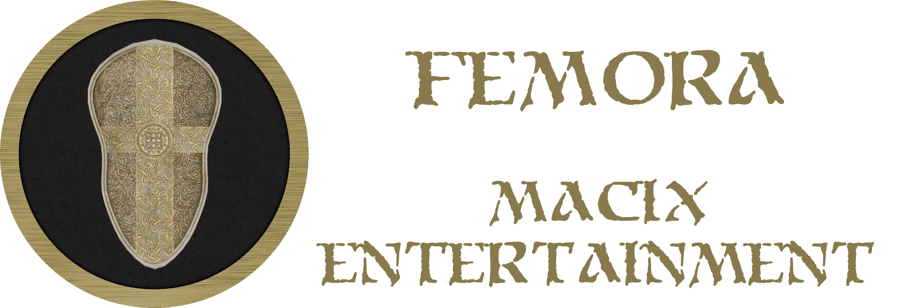

## Important links
[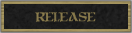](https://github.com/Macix97/femora/releases)
[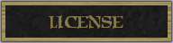](https://github.com/Macix97/femora/blob/main/LICENSE.txt)
[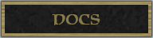](https://macix97.github.io/femora/docs/index.html)
[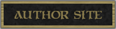](https://macix97.github.io)

## Abstract

Femora is a hack and slash game based on Diablo II created by Blizzard Entertainment. The history takes place in medieval-fantasy universe where Prime Evil tries to destroy the last bastion of humanity. In the game appear a lot of monsters and mechanisms known in titles like Titan Quest or Path of Exile.

## Gameplay

Action of the game goes on ancient land named Femora. From a certain date wild horde tries abandoned humanity from their kingdom. The bloody battles are consumed many brave warriors. There is no way to escape this madness. The only one chance is find Prime Evil and break to Pandemonium of Doom. There is one human who can do this - it's you!

## Hero class

The player can take on the role of a Paladin - Holy Warrior who wreaks havoc in the ranks of the enemies. He is a specialist in cold weapon and auxiliary magic. This great knight is able to carry heavy armors and giant swords and is extremely resistant to damage. His advantage is combat ability which can be supported by passive fighting skills. Nobody can match him in hand-to-hand combat.

## Enemies

There are several creatures threatening humanity:
* Zombie - The weakest spawn of Hell.
* Skeleton - Slow, brawny warrior with a heavy sword.
* Demon Skeleton - Agile swordsman that dealing quick blows.
* Rotfiend - Extremely fast fighter with great strength.
* Pit Fiend - Huge, muscular beast that using gigantic axe.
* Efreeti - Fiery demon that throws fireballs.
* Hell Knight - The most powerful inhibitant of Pandemonium of Doom.

## Locations

In the game there are four main areas:
* Refugee Camp - Destroyed defensive fortification inhabited by surviving warriors.
* Stony Plain - Invaded lowland which is covered with lush grass.
* Death Valley - Abandoned desert with no life.
* Hell Pit - Hellish land immersed in flames and lava.

## Independent characters

In Refugee Camp there are two traders:
* Mirlanda - Gifted Alchemy preparing potions and decoctions.
* Orik - Skilled Blacksmith forging swords.

## Other features

The game has the following properties:
* The hero acquires experience by killing enemies. After defeating the appropriate number of opponents they can increase their skills.
* The creatures leave items which can be using by hero.
* The player uses health and magic energy. Both of these attributes can be regenerated by elixirs.
* The local currency (Gold) allows the exchange of goods.
* In Femora there are hideouts with treasures.
* The available weapons are divided into categories. Each of them improves the hero's abilities by a certain factor.
* Each of area represents certain difficulty level.
* Each subsequent level requires more experience.
* Realistic day and night cycle provides extra feelings and additional impressions.

## Game visualization

### The pictures below show the most important aspects of the game:

#### Main Menu
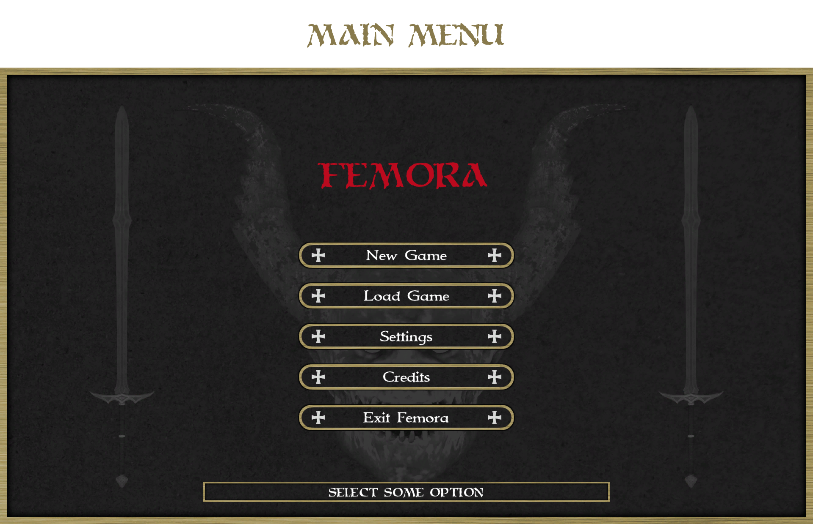
#### Hero Choice
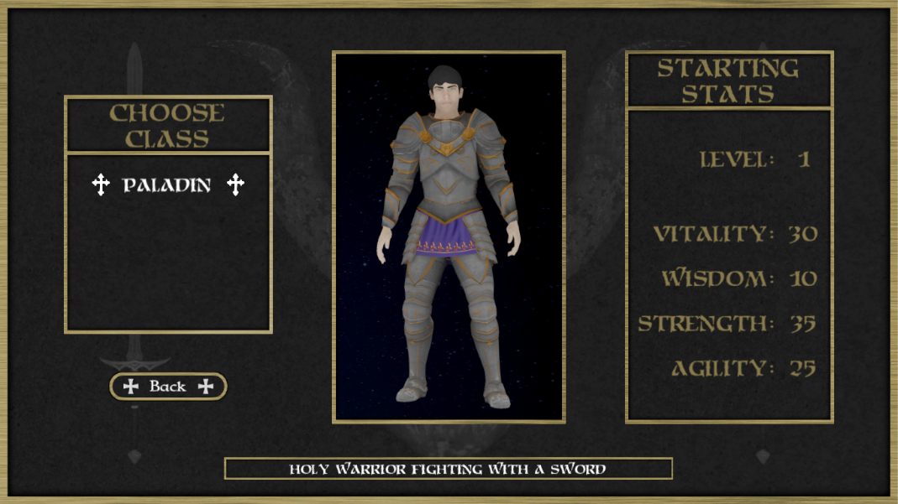
#### Return to Refugee Camp
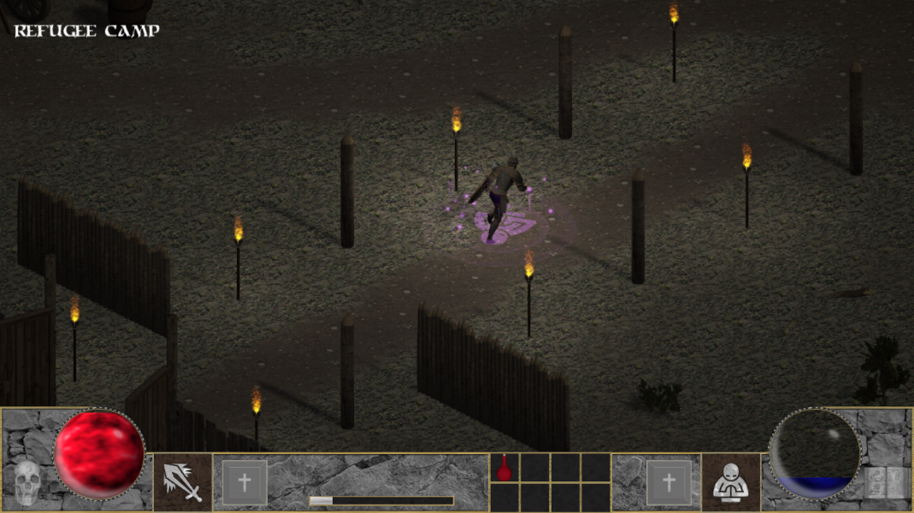
#### Dialogue With Mirlanda
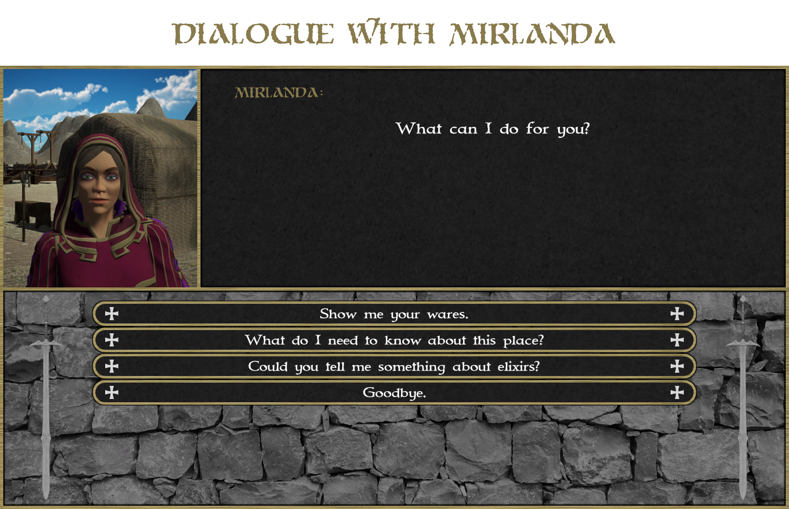
#### Trade
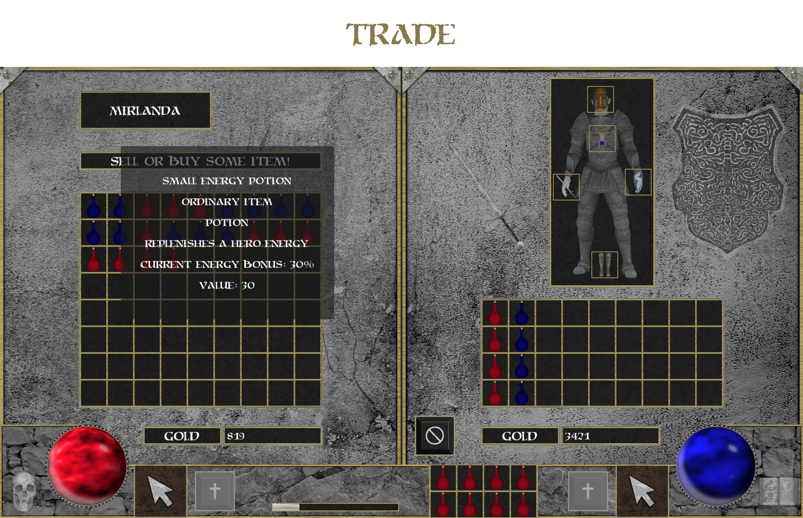
#### Hero Development
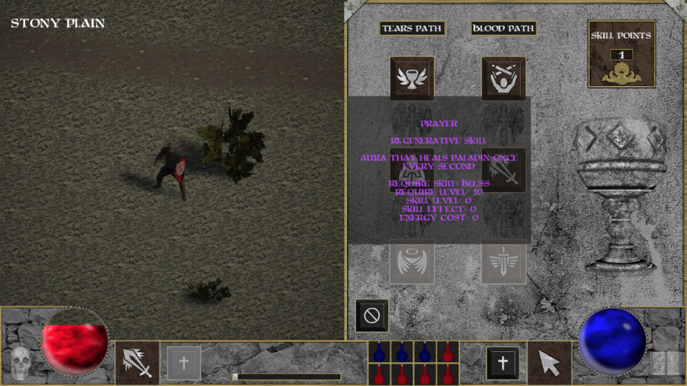
#### Combat
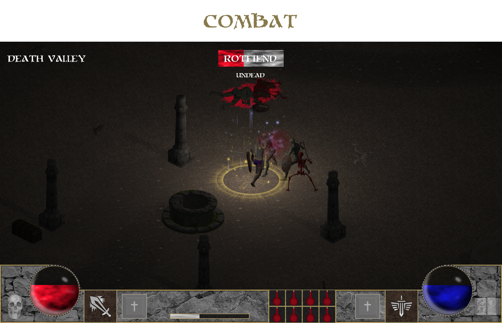
#### Game Over
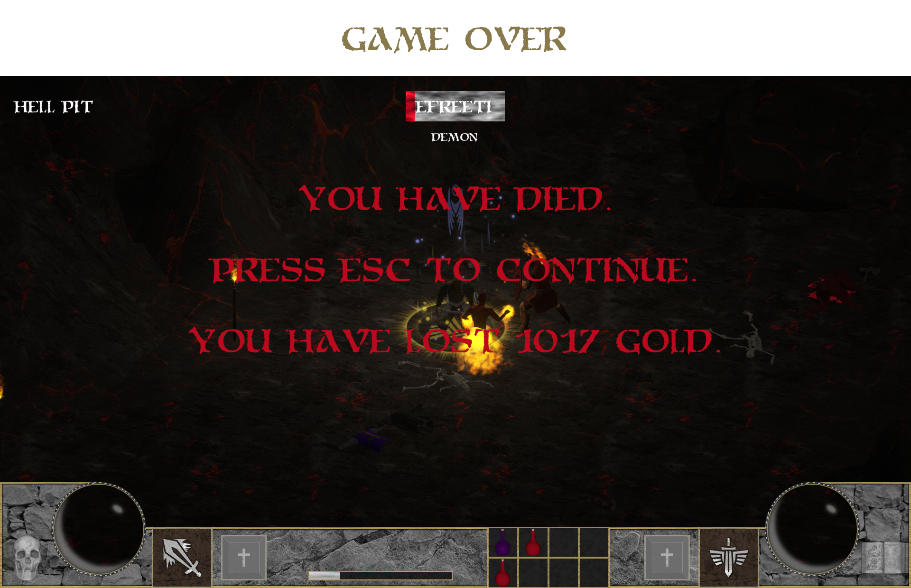

## Used technologies

The list of used solutions:
* Unity 2019.2.2f1 - Efficient and expanded game engine.
* Visual Studio Code 1.50.1 - Primary, lightweight IDE.
* Blender 2.83 - 3D computer graphics software used for creating visual effects.
* GIMP 2.10 - Open source image editor.
* Mixamo 2020 - Web service that provides animations with characters.
* Audacity 2.3.2 - Easy-to-use audio editing software.
* MakeHuman 1.2.0 - 3D graphics middleware for prototyping humanoids.

## Credits

The author of the project have using many of arts shared by CC0 or CC BY license. Without this support, the game would not be possible. A complete list of the used materials and their creators can be found in the credits text file. Information can also be obtained by selecting the appropriate tab from the game menu.
